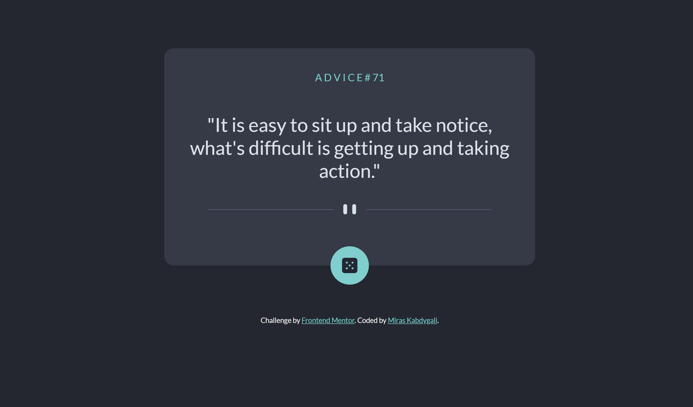

# Frontend Mentor - Age calculator app solution

This is a solution to the [Age calculator app challenge on Frontend Mentor](https://www.frontendmentor.io/challenges/age-calculator-app-dF9DFFpj-Q). Frontend Mentor challenges help you improve your coding skills by building realistic projects. 

## Table of contents

- [Overview](#overview)
  - [The challenge](#the-challenge)
  - [Screenshot](#screenshot)
  - [Links](#links)
- [My process](#my-process)
  - [Built with](#built-with)
  - [What I learned](#what-i-learned)
- [Author](#author)

## Overview

### The challenge

Users should be able to:

- View the optimal layout for the app depending on their device's screen size
- See hover states for all interactive elements on the page
- Generate a new piece of advice by clicking the dice icon

### Screenshot



### Links

- Solution URL: [FrontEndMentor](https://www.frontendmentor.io/solutions/advice-generator-qcYG5OGCey)
- Live Site URL: [Github](https://mkab2000.github.io/Advice-Generator/)

## My process

### Built with

- Semantic HTML5 markup
- CSS custom properties
- Flexbox
- CSS Grid
- Mobile-first workflow


### What I learned


Learned how to operate with API data fetching
```js
fetch('https://api.adviceslip.com/advice')
  .then(response => response.json())
  .then(data => {
    const adviceText = data.slip.advice;
    document.querySelector('#advice-text').textContent='"'+adviceText+'"';
    const adviceId = data.slip.id;
    document.querySelector('#advice-id').textContent="A D V I C E  # " + adviceId.toString();
  });
```
Funnily enough, the documentation for their API on adviceslip seems to be outdated and to access the slip's id, slip.id was required instead of slip.slip_id;

## Author

- Website - [Miras Kabdygali](https://github.com/mkab2000)
- Frontend Mentor - [@miraskab](https://www.frontendmentor.io/profile/miraskab)
